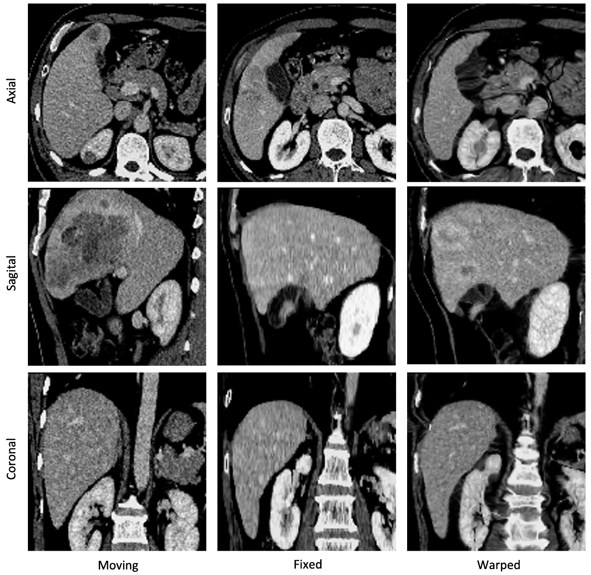

# CMAN: Cascaded Multi-scale Spatial Channel Attention-guided Network for Large 3D Deformable Registration of Liver CT Images
By Xuan Loc Pham, Manh Ha Luu, Theo van Walsum, Hong Son Mai, Stefan Klein, Ngoc Ha Le, Duc Trinh Chu   
https://www.sciencedirect.com/science/article/pii/S1361841524001373

:rocket: 03/2023: Submitted to Medical Image Analysis journal \
:rocket: 04/2023: Under review \
:rocket: 01/2024: The manuscript of CMAN has been potentially accepted for Medical Image Analysis journal. We're currently working on the revisions. \
:rocket: 05/2024: CMAN has been published in the Medical Image Analysis journal.

# Introduction
CMAN is a deeplearning-based image registration platform, which is designed specifically to handle the large and complex deformations between images. We verified the performance of CMAN through extensive experiments on multi-source liver datasets.

# Architecture
CMAN solves the large deformable liver CT registration problem by dividing the large deformation field into a chain of densely connected global-local multi-resolution smaller deformation fields. Consequently, the liver would be deformed gradually, little-by-little until it reaches the desired shape, which is more effective than other one-time deformation methods. Besides, a combination of spatial-channel attention module is also integrated into each layer of every base network for better refinement of the deformation field.


<!--  -->

# Environment setup
1. Install [miniconda](https://docs.conda.io/en/latest/miniconda.html)
2. Create and setup conda environment (Pls be aware of the versions of the packages and your cuda version) 
``` bash
conda create --name CMAN python=3.7.13 
conda activate CMAN
pip install tensorflow==1.15.0 keras==2.1.6 tflearn==0.5.0 numpy==1.19.5 protobuf==3.20 SimpleITK h5py tqdm scipy scikit-image matplotlib
```
3. We will soon provide a Docker for the project for ease of reproducibility

# Data preparation
Example preprocessed datasets could be found in [SLiver, LiTS, LSPIG](https://drive.google.com/file/d/1xQMmYk9S8En2k_uavytuHeeSmN253jKo/view) and [MSD, BFH](https://drive.google.com/file/d/17IiuM74HPj1fsWwkAfq-5Rc6r5vpxUJF/view.). Note that only LSPIG dataset support pair-wise registration.\
Example of json file could be found in `./datasets/liver.json` 
 
If you want to use your own dataset, please follow these 2 steps for the data preparation (Refer to file `data_preprocess.py` for the generation of h5 file and json file):
1. Compress each of your dataset in a single h5 file
- Original data folder should look like this:
```
data_train_folder
├── Patient_0
│   ├── ct.nii.gz
│── Patient_1
│   ├── ct.nii.gz
...

data_val_folder
├── Patient_0
│   ├── ct.nii.gz
│   ├── seg.nii.gz
│── Patient_1
│   ├── ct.nii.gz
│   ├── seg.nii.gz
...

``` 
- The generated h5 datasets will have the structure as follow:
```
datasets/eval_data_0.h5
├── Patient_0
│   ├── volume
│   |── segmentation
│── Patient_1
│   ├── volume
│   |── segmentation
...

datasets/eval_data_1.h5
├── Patient_0
│   ├── volume
│   |── segmentation
│── Patient_1
│   ├── volume
│   |── segmentation
...

datasets/train_data_0.h5
├── Patient_0
│   ├── volume
│── Patient_1
│   ├── volume
...

datasets/train_data_1.h5
├── Patient_0
│   ├── volume
│── Patient_1
│   ├── volume
...
```
2. Config json file to include all datasets (both training, evaluation and testing)

# Training
Run the following command for training:
```bash
python train.py -b [BASE_NETWORK] -n [NUMBER_OF_CASCADES]
```

Example:
```bash
python train.py -b CMAN_CA -n 5 --batch 1
python train.py -b CMAN -n 4 --batch 1 -c weights/checkpoints
```

For more options, please refer to file `train.py`

# Inference
Run the following command for unpaired inference:
```bash
python eval.py -c [WEIGHTS] -v [DATASET]
```
or this command for paired inference
```bash
python eval.py -c [WEIGHTS] -v [DATASET] --paired
```
Example:
```bash
python eval.py -c weights/Sep05_0238 -v sliver --batch 1
python eval.py -c weights/Sep15_1323 -v lspig --paired
```
For more saving options, please refer to file `eval.py`. Full saving option includes:
```bash
keys = ['jaccs', 'dices', 'landmark_dists', 'jacobian_det', 'real_flow', 'image_fixed', 'warped_moving', 'warped_seg_moving']
```
The registration results could be found in the `evaluate` folder. Customize the path to save results by referring to file `eval.py` and change the variable `link`
```bash
link = './evaluate/main_dataset/' + model_name + ...
```
# Quick trial
For a quick trial of CMAN, please download a preprocessed dataset above (Ex: sliver dataset), add to the datasets folder, and then download the [5-cascade pre-trained weight](https://vnueduvn-my.sharepoint.com/:f:/g/personal/xuanloc97ars_vnu_edu_vn/Epr0XIRCQzdDikuXiqNf1MwBKp9zVXRZiph3KBWsyNs3Kw?e=8QbWyk) or [3-cascade pre-trained weight](https://vnueduvn-my.sharepoint.com/:f:/g/personal/xuanloc97ars_vnu_edu_vn/EnN705dPswtNgiHje8wmrxABDSYJ46Pd-DVunL8BZmmVoA?e=qHKnm7). Then run the inference command
```bash
python eval.py -c weights/3-cascade -v sliver 
```


# Results
Here are some positive results when applying CMAN to align image pairs with large and complex deformations.



# Reference 
The implementation of CMAN is based on the following source:
- [RCN](https://github.com/microsoft/Recursive-Cascaded-Networks/tree/master)
- [VoxelMorph](https://github.com/voxelmorph/voxelmorph)

We recommend the use of MevisLab for the analysis and visualization of data in this work
- [MevisLab](https://www.mevislab.de/)

# Contact
For more information of CMAN (theory or source code), please email: xuanloc97ars@vnu.edu.vn
